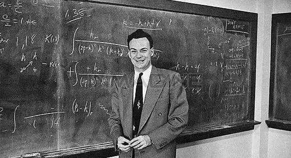

# 1.2 整体性学习的顺序

时间 : 2022/11/25 14:20:33

## 结构

这里写主要线索。

***

1. 整体性学习的顺序
2. 获取阶段
   1. 目标简化、容量、速度
3. 理解阶段
4. 拓展阶段
   1. 深度拓展
   2. 横向拓展
   3. 纵向拓展
5. 纠错阶段

## 笔记与思考

这里是主要的笔记内容。

***

- 整体性学习的顺序(夯实基础、拉伸挑战、举一反三、融会贯通)，以及伴随每一步的测试步骤。
  1. 获取，目标：获取信息准确，并尽可能压缩信息量
  2. 理解，目标：理解信息的含义，并完成与上下文的联系（建立基本连接）
  3. 拓展，目标：进一步构成模型、高速公路的更广泛连接，从而获得良好结构
  4. 纠错，目标：在模型和高速公路中剔除错误和无效连接
  5. 应用，目标：在真实时间中实践，验证并调整结构，最终形成可以良好“运作”的知识结构
     &#x20;  X.  测试，上述每一步都需要测试，目标：发现问题，改进学习技术
  整体性学习的顺序并不是一成不变的线性顺序，步骤之间可以往返，也可以跳跃。
- 获取阶段

  获取信息时的3个目标：简化、容量、速度
  1. 简化：只掌握对形成模型有帮助的内容，近可能删除其他无用的东西。
  2. 容量：在简化之后，获取尽可能多的信息
  3. 速度：用最少的时间，获取最多的有效信息
- 理解阶段

  信息理解的3个层次：理解阶段、拓展阶段、应用阶段

  “理解阶段：理解信息的表面意思”

  “尽管理解阶段有局限，但是这个阶段非常关键，除非先获取信息和理解它的字面意思，否则你就没有机会深入下去。”
- 拓展阶段

  “拓展才是整体性学习的真正开始”

  “在这个阶段要应用模型来简化和扩展你的结构，同时也要拓展对信息的理解，包括信息的由来（问为什么？）以及与其他信息是怎么联系在一起的。”

  拓展是符合人的本性的，“人们都有进一步了解知识来龙去脉的好奇之心，保持这个好奇之心吧，它是我们学习、创造的源泉。”

  “拓展有三种主要方式：深度拓展、横向拓展和纵向拓展。”
  1. 深度拓展，要在知识内部创造连接。不单要理解结论，还要深究论据或验证过程
  2. 横向拓展，要在知识周围建立连接，在模型与原知识之间建立连接
  3. 纵向拓展（是否叫联想拓展或者类比拓展更合适），要求在结构间建立告诉通道，比喻法和内在化是进行纵向拓展的最好方法
- 纠错阶段

  “纠错可以看作在整体性知识网络中做修剪工作，添加一些特殊的例子，删除一些现实中不存在的联系，这不是一个完美的过程，修剪工作是必要的。”
- 应用阶段

  应用是学习的最终目的

  “知识中的很大一部分存在于潜意识中，这部分知识如果不去运用就得不到很好的发展。”
- 测试阶段

  &#x20;    获取阶段的测试──我以前看过或听过这个知识吗？

  理解阶段的测试──我理解知识的含义吗？（至少是字面上的意思。）

  拓展阶段的测试──我知道知识从何而来，与哪些知识有关系吗？

  纠错阶段的测试──我删除了那些不恰当的联系吗？我删除了那些错误结论吗？

  应用阶段的测试──我将知识用到实际生活中了吗？
- 总结

  整体性学习的顺序并不是一成不变的线性顺序，步骤之间可以往返，也可以跳跃。

  在践行整体性学习过程中，需要持续发现弱点，才能知道需要掌握何种技术去弥补缺陷
  1. 获取不好的表现：速度慢、需要反复；解决办法：养成良好的学习、阅读和记笔记的习惯。并通过良好结构的知识体系提升获取和理解信息的效率
  2. 理解不好的表现：文字晦涩、新概念较多、只注意笔记等形式化动作而非理解本身。
  3. 拓展不好的表现：缺少灵活性，当问题背景发生些许变化时，已经学习的知识无法使用。
  4. 纠错不好的表现：知识间的错误联系较多，常常不能发现自己在某个主要的看法或问题上是错误的。
  5. 应用不好的表现：“书本智慧”，空有华丽的理论却不会应用于真实世界。解决方法：唯一办法是更多的实践
     确认弱点：
  “知道了弱点所在，你就可以通过多多练习来改进。一开始，采用新技术总是要花一点时间的，一旦掌握之后，它们就成了属于你自己的学习策略。”

## 摘抄

> 费曼学习法核心，是把复杂的知识简单化，以教代学，让输出倒逼输入。
>
> ＃输出思维：不卡壳地复述学习内容才是学全。
>
> ＃简化思维：把高深的知识用平实的话说出来，才是学透。
>
> ＃检测学习效果的重要途径，是有能力把它传播给另一个人。

>

## 总结

这里写总结。

***

- 重要内容总结
  1\.
  2.
  3\.
