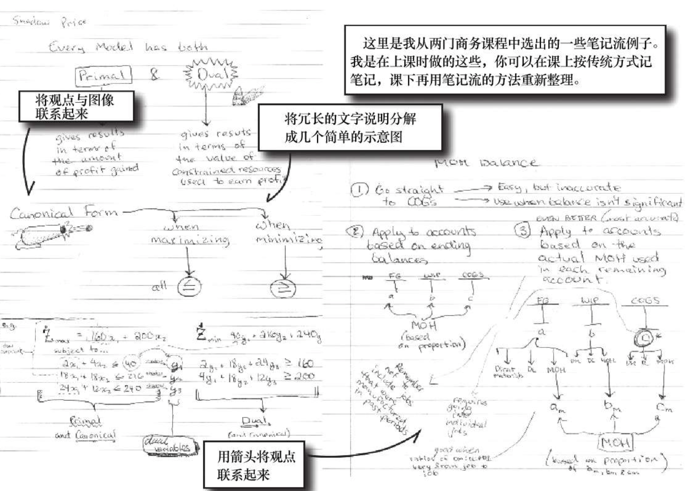
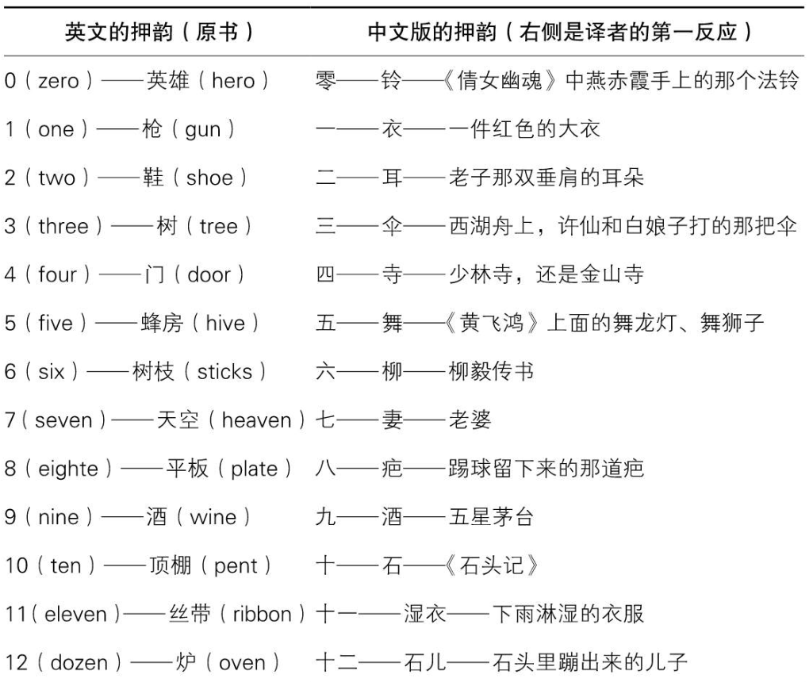
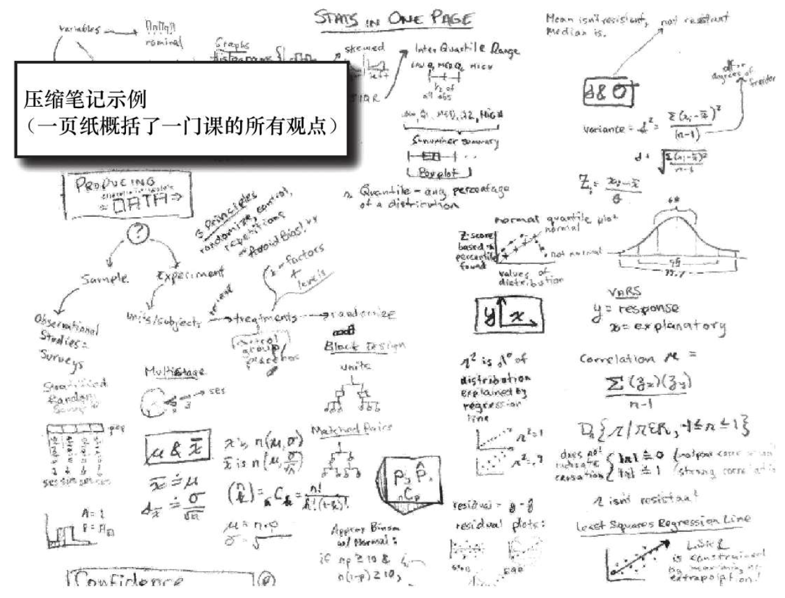

# 2.1 整体性学习技术

## 结构

这里写主要线索。

***

1. 将要介绍的技术：
   1. 获取知识
   2. 联系观点
   3. 随意信息的处理
   4. 知识扩展

## 笔记与思考

这里是主要的笔记内容。

***

- 技术一览

  A）获取知识

  1）快速阅读

  2）笔记流

  B）联系观点

  1）比喻

  2）内在化

  3）图表法

  C）随意信息的处理

  1）联想法

  2）挂钩法

  3）信息压缩技术

  D）知识扩展

  1）实际应用

  2）模型纠错

  3）以项目为基础的学习
- 获取知识
  - 快速阅读
    1. 指读法，通过将手指放到正在读的那一行下面，通过手指移动控制目光聚焦到要阅读的文字上
    2. 练习阅读法，通过测试并练习：单位时间内容的阅读字数或正确理解的知识点，不断提升阅读速度和理解力
    3. 积极阅读法，强调深入理解材料，要求读完章节后记下：主要观点、如何记忆该观点、如何拓展该观点，以及如何应用该观点。
       快速阅读是一种技能，需要反复的刻意联系。
  - 笔记流&#x20;
    1. 学习的目的不是为了漂亮的笔记，要遵守“一次学会”原则
    2. 基本笔记流，用词或短语记下观点，然后用线表达观点间的关系
    3. 混合笔记法，涉及2个方面：记录与拓展，如果课堂的信息量极大或者需要课后好好复习，可以采用传统线性笔记 与 笔记流结合的混合笔记流方法
    4. 课下笔记流，课上只做传统笔记，下课整理笔记流
    5. 评注流，先标记重点，然后再添加联系
       
- 联系观点&#x20;
  1. 比喻法：
     - 比喻法：熟悉的知识 →理解→ 不熟悉的知识桥梁&#x20;
       1. 深入理解和记忆的信息
       2. 在个人经验中找到「部分相似」的知识
       3. 检查比喻中「不恰当」的地方
     - 使用场景：用于困难信息和关键信息的处理
       1. 困难信息：包括抽象信息、随意信息
       2. 关键信息：学习其他知识的基础，是整个领域知识的“地基”
     - 技巧：提升比喻的速度和质量
       1. 要有寻找比喻的欲望
       2. 注意第一个出现在脑海中的念头
       3. 优化和测试你的比喻
  2. 内在化
     - 使用场景：具体信息的内在化效果最好
     - 内在化（视觉化）：将知识转化为大脑中的图像，并配入声音、触觉和情感的理解方法
     - 技巧：
       1. 明确内在化的目标
       2. 脑海中建立图像
       3. 让图像动起来
       4. 加入其他感官和情感
       5. 重复和优化以上作品
  3. 图表法
     - 使用场景：是内在化的简化输出，让人们更容易看明白
     - 图表法，图表是一副将多个信息压缩在一起的图画
     - 技巧：

       常用的三种图表：流程图、概念图、图像

       图表可以和比喻、内在化混合在一起，以加深对知识的理解
- 随意信息的处理

  随意信息是整体性学习的一个难点，它结构性弱
  - 联想法

    通过将一系列信息点串联起来形成链条，以取得关联记忆的目的。
    1. 拆解成数列，并确定顺序
    2. 给数列中的每个元素，设置一个助记符号
    3. 创建「生动夸张」的图像（类似于内在化），以辅助记忆
    4. 回忆，并检验记忆效果
       难点：
    5. 重复→ 加上不同颜色
    6. 数列太长 → 分组然后嵌套
    7. 难以辨认的符号 → 用自己熟悉的符号
    8. 触发物丢失 → 用熟悉的事物，与数列第一个对象关联
  - 挂钩法

    需要建立一套与数字绑定的助记符号系统，比如下面的：

    

    用于数字类信息的记忆，将数字与熟悉的事物绑定，通过这些熟悉事物来辅助记忆数字
  - 信息压缩技术

    三种方法进行信息压缩：记忆术、图像联系、笔记压缩法
    1. 记忆术，将目标知识拆解成常用的短语或词，以辅助记忆
    2. 图像联系，将几个信息联系起来并用一张图表表示，是联想法和图表法的综合
    3. 笔记压缩法，将一大堆知识减少到一页或几页笔记
       1. 提炼笔记中的主要观点
       2. 写出与之联系的观点、公式、概念和定义
       3. 持续上述过程，直到将笔记中所有主要观点都写出来
       4. 有时候需要重复上述过程，以继续压缩
          
- 知识扩展
  - 实际应用

    “通过将知识应用于实际，知识就会记得更牢。”

    “实际应用并非一种按步骤进行的技术，它是一个创造性的过程”
  - 模型纠错

    “模型纠错实际上就是实践的代名词：不断地练习和实践，在实践中发现问题，测试自己是整体性学习过程中纠错的唯一手段。”
    - 一些建议：
      1. 分清简单错误还是概念错误，若是后者需要优化自己的模型、比喻法和内在化策略
      2. 散弹枪策略，即：遍历全部类型的问题
      3. 延伸练习时间，把总的练习时间分配到每一天
  - 以项目为基础的学习

    设定一个需要1\~3个月达成的目标，达成目标的过程就是学习的过程，而达成目标即达到了学习效果
    - 建议：
      1. 从小项目开始
      2. 项目过程记录下来
      3. 创造一个有意义的目标
- 费曼技巧

  操作流程：
  1. 选择要学习的概念，并将这个知识点写在白纸上
  2. 设想你是老师，如何教会一名新生这个知识点
  3. 当你感到卡壳时，返回去重新学习
  4. 简单化和比喻，用简单、直白的语言重新表述它

## 摘抄

> **智力挑战**：
> 这个挑战的目的是让你适应快速阅读的技巧，快速提高阅读速度和理解力。我个人建议只有在完成本次挑战之后，才进行下次智力挑战。
> 1.买一两本内容适合做快速阅读练习的书。
> 2.确保至3周内每天15分钟进行阅读速度和理解力的练习（具体方法见“练习阅读”一节）。
> 3.练习指读法两周。
> 4.每周练习1次积极阅读。

> 智力挑战
>
> 本次智力挑战在于提高你运用比喻法理解和记忆抽象信息的能力。
>
> 1.坚持至少两周内每天一次好好阅读学习内容，阅读完教材或笔记后，写下至少五个主要观点。
>
> 2.针对每个观点，写一个可以解释观点的比喻。
>
> 3.假如比喻不能完全解释观点，尝试寻找更多可以解释观点的比喻。
>
> 4.应用10岁规则。是否能用这个比喻解释给一个10岁的小孩听？假如你的比喻还是和原始观点一样，孩子听不懂。重新来过吧，直到你找到简单的他能明白的比喻。
>
> 5.针对其他观点，重复上述过程，直到你确定自己真正理解为止。”

> “理查德D. 费曼（Richard D Feynman），美国物理学家，诺贝尔奖获得者，曾经任教于普林斯顿大学物理系。费曼挑战任何一位普林斯顿大学数学系的教授，即不管这些教授告诉费曼多么复杂难懂的数学知识，只要他们使用简单的术语（不得使用费曼觉得生僻复杂的单词或术语）去描述，费曼就一定会得出同样的结果。”

## 总结

这里写总结。

***

- 整体性学习技术的回顾
  1. 对于整体性学习，理论和技术是同等重要的2个部分，而实践对掌握这一学习方法 至关重要。
  2. 整体性学习能帮你找到学习中的薄弱环节，而这些环节，不单告诉你需要重点掌握的知识，同时也帮你持续改进学习方法。最终成为自然而然的习惯，使你的学习效率大幅提升
  3.
