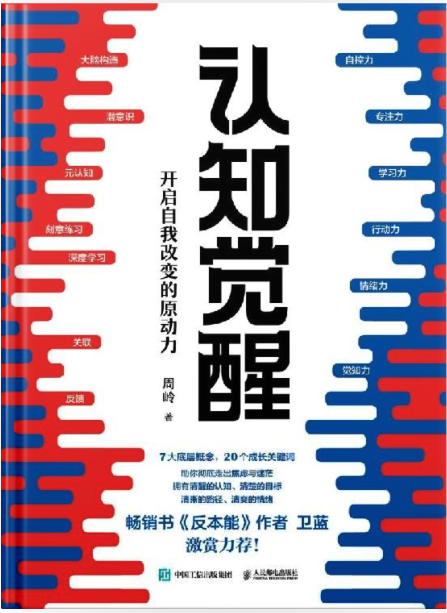

# 《认知觉醒》

| 作者     | 周岭         |
| ------ | ---------- |
| 出版社    | 人民邮电出版社    |
| 状态     | 已读         |
| 评分     | ⭐️⭐️⭐️⭐️⭐️ |
| 阅读完毕日期 | 2022/11/14 |

### 封面

### 简介

“本书适合所有希望成长的人阅读，无论你从事什么职业、处于什么年龄、扮演什么角色，它都能对你有所启发。特别是对于那些缺乏耐心、急于求成、极度焦虑的人，暂时缺少人生目标、过得浑浑噩噩的人，想变好但只知道靠毅力苦苦支撑的人，想掌握学习方法、提高学习成绩的人，想了解底层成长规律、主动创造成就的人……如果你位列其中，这本书肯定能让你豁然开朗，并内化出真正的认知驱动力。另外，我也特别希望年轻人，尤其是那些还未踏入社会的同学能看到这本书，因为你们正处在起步阶段，若能借此书觉醒，便可避免走很多人生弯路，让自己比同龄人领先一步甚至多步，这相当于直接减少了生命消耗啊！”
